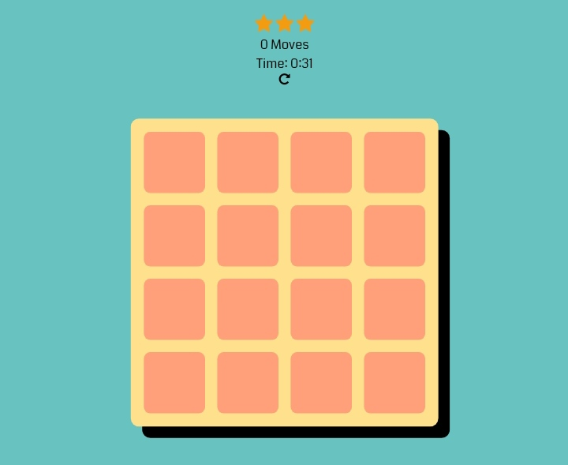

# MindMatch Game

MindMatch is an interactive memory game built with HTML, CSS, and JavaScript. Test your memory skills by matching pairs of cards with identical symbols.

## Features

- **Memory Challenge:** Flip cards and match pairs to complete the game.
- **Timer:** Track your time to add an extra challenge.
- **Moves Counter:** Keep count of your moves.
- **Star Rating:** Achieve a star rating based on your performance.

## Screenshots



## How to Play

1. Open [] in your web browser.
2. Click on cards to flip them and find matching pairs.
3. Try to match all pairs as quickly as possible.

## Getting Started

1. Clone the repository:

   ```bash
   git clone https://github.com/JohnDev19/MindMatch-Game.git
   ```

2. Open `index.html` in your preferred web browser.

## Dependencies

- [Font Awesome](https://fontawesome.com/) - Icon library.
- [SweetAlert2](https://sweetalert2.github.io/) - Beautiful, responsive, customizable alert dialogs.
- [Animate.css](https://animate.style/) - Cross-browser CSS animation library.

## Contributing

Contributions are welcome! Fork the repository, make your changes, and submit a pull request.

## Credits

- Author: John Ré Poras

## License

This project is licensed under the MIT License - see the [LICENSE](./LICENSE) file for details.
